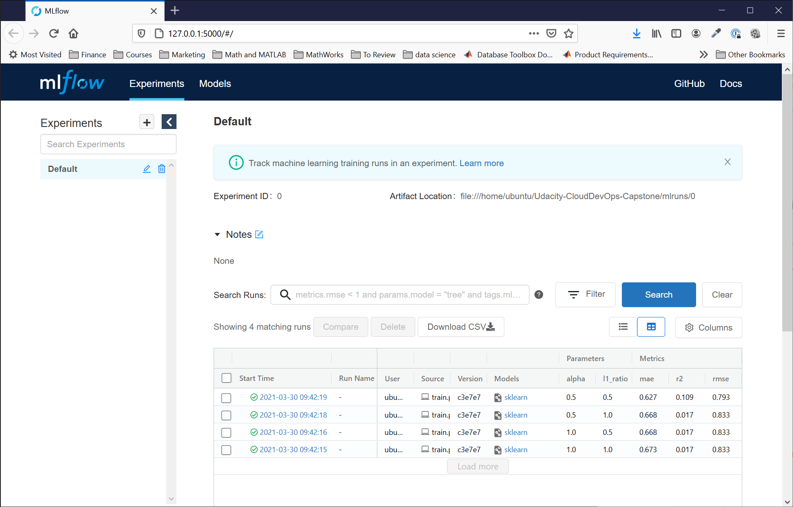

# Instructrions for running on a local machine

## Data Scientists Sandbox

The commands shown below will install, build, test, and run MLFlow with all the required dependencies on Ubuntu.  This configuration is the minimalist configuration in that it installs MLFlow and it's dependencies only.  This configuration can be used for a local tracking system of machine learning models.

```bash
    make setup-ubuntu
    make install-local
    make build-local
    make run-local
```

After running these commands, you should see the MLFlow experiment tracking app in a local browser (http://127.0.0.1:5000).



## Desktop Development with Minikube

This configuration will build and test a local development environment that mirrors the AWS deployed application.  It uses:
1. [Minikube](https://minikube.sigs.k8s.io/docs/start/) to replicate [Kubernetes](https://kubernetes.io/)
2. [Docker](https://www.docker.com) for images and image scanning
3. [Hadolint](https://github.com/hadolint/hadolint) for linting Dockerfiles
4. [MinIO](https://min.io) for S3 bucket emulation
5. [PostgreSQL](https://www.postgresql.org/) for MLFlow backend storage

To install and run on a clean Ubuntu installation:   
```bash
    make setup-ubuntu
    make install-local-k8
    make build-local-k8
    make run-local-k8
```
Next you will need to modify host files to add in the address of the MINIO and MLFlow.  The host file is located in /etc/hosts and the shell script `manage-etc-hosts.sh` can be used to do this.

Next you will need to configure MINIO to have an mlflow folder.  


After running these commands, you should see the MLFlow experiment tracking app in a local browser (http://127.0.0.1:5000).


You can also run `make clean` to clean up temporary downloaded files, and `make destroy` to shut down and delete pods created in minikube.