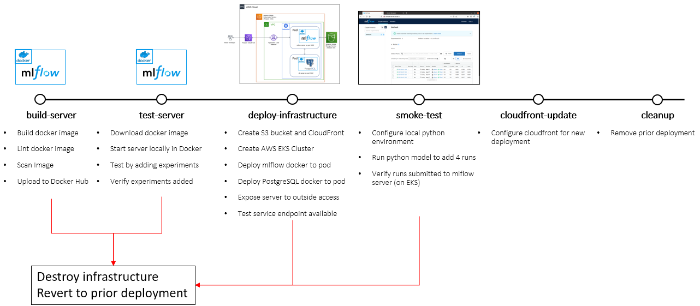
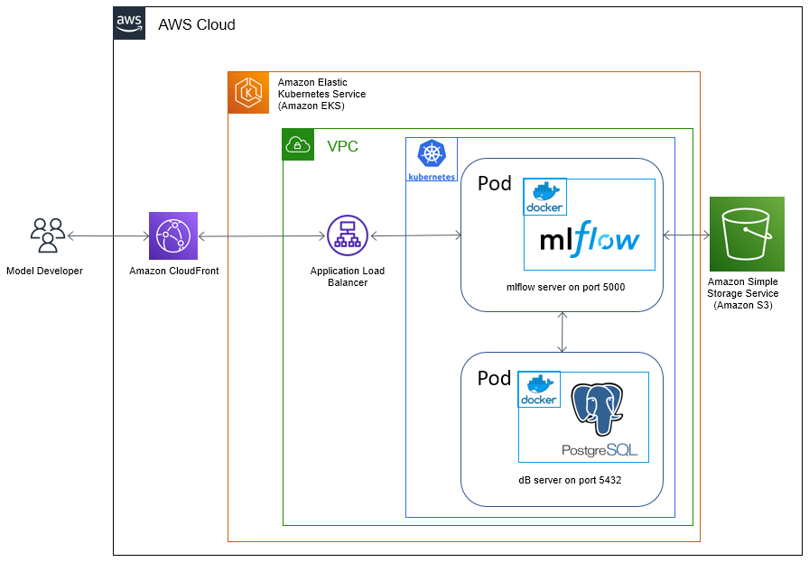
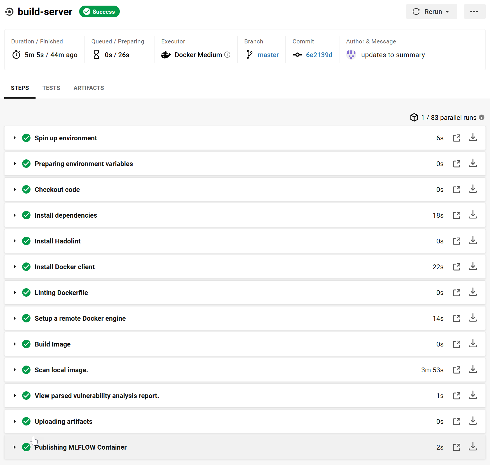

# CAPSTONE PROJECT FOR UDACITY's Cloud DevOps Engineering Nanodegree

## Project Scope

Continuous Delivery of a web service for managing machine learning models using [MLflow](https://mlflow.org).  Illustrated below is the pipeline chosen for building MLFlow into a docker container and deploying it to AWS EKS. 

The architecture for the project is shown below.

This project uses a blue/green deployment approach by modifying CloudFront for a new deployment.  If a new job fails along the way, any infrastructure created is destroyed and the prior deployment remains operational.

## Circle CI

The pipeline chosen was implemented in .circleci/config.yml.  Show below are screen shots for successful deployment.

Shown below are screenshots for testing of a failed lint job.

Shown below are screenshots for a failed scan job.

