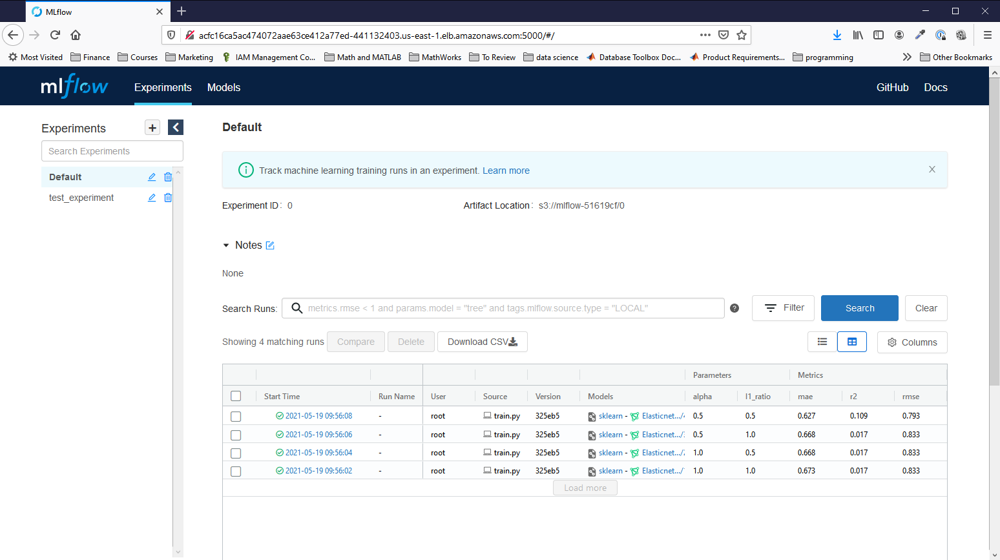

# Capstone Project For UDACITY's Cloud DevOps Engineering Nanodegree

## Project Scope

Continuous Delivery of a web service for managing machine learning models using [mlflow](https://mlflow.org).  Illustrated below is the pipeline chosen for building mlflow into a docker container and deploying it to AWS EKS. 

The architecture for the project is shown below.

This project uses a blue/green deployment approach by modifying CloudFront to point to a new mlflow server url from EKS for a new deployment.  If a new job fails along the way, any infrastructure created is destroyed and the prior deployment remains operational.  This is denoted in the red lines in the pipeline diagram above.

## Circle CI Automation

The pipeline chosen was implemented in `.circleci/config.yml`.  Show below are screen shots for successful deployment.

Shown below are screenshots for testing of a failed lint job of the Dockerfile and the passed file.

Shown below are screenshots for a failed scan job and succesful scan of the Docker container.

## Deployment
Once deployed, the mlflow user interface can be accessed through the url set up in cloudfront and the associated S3 bucket (with redirect).  The url is an output of the cloudformation job associated to cloudfront.

It will redirect to the service exposed in the kubernetes pods on port 5000.  Here is an example screenshot of the originally deployed service.

Here is a screenshot of the service after a second deployment.  Note the change in the parameters used for the second deployment are different (alpha and l1_ratio were changed and resubmitted to git to trigger the new deployment).  

## Project Rubric

### Set Up Pipeline
Criteria | Meets Specifications | Artifact
--- | --- | ---
Create Github repository with project code. | All project code is stored in a GitHub repository and a link to the repository has been provided for reviewers. | [repo](https://github.com/StuKozola/Udacity-CloudDevOps-Capstone)
Use image repository to store Docker images | The project uses a centralized image repository to manage images built in the project. After a clean build, images are pushed to the repository. | [registry](https://hub.docker.com/r/kozola/mlflow_server)

### Build Docker Container
Criteria | Meets Specifications | Artifact
--- | --- | ---
Execute linting step in code pipeline | Code is checked against a linter as part of a Continuous Integration step (demonstrated w/ two screenshots) |   
Build a Docker container in a pipeline | The project takes a Dockerfile and creates a Docker container in the pipeline. | [Dockerfile](Dockerfile)

### Successful Deployment
Criteria | Meets Specifications | Artifact
--- | --- | ---
The Docker container is deployed to a Kubernetes cluster | The cluster is deployed with CloudFormation or Ansible. This should be in the source code of the student’s submission. | [S3 Bucket](.circleci/aws/artifact-store.yml), [cloudfront](.circleci/aws/cloudfront.yml), [Kubernetes is deployed through eksctl](.circleci/config.yml)
Use Blue/Green Deployment or a Rolling Deployment successfully | The project performs the correct steps to do a blue/green or a rolling deployment into the environment selected. Student demonstrates the successful completion of chosen deployment methodology with screenshots. |  