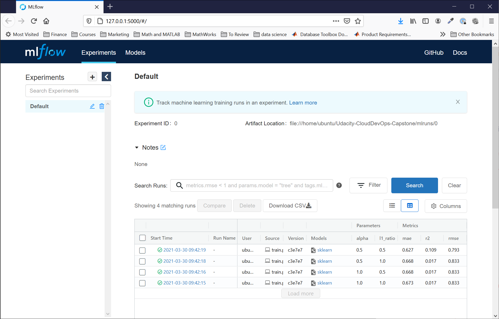
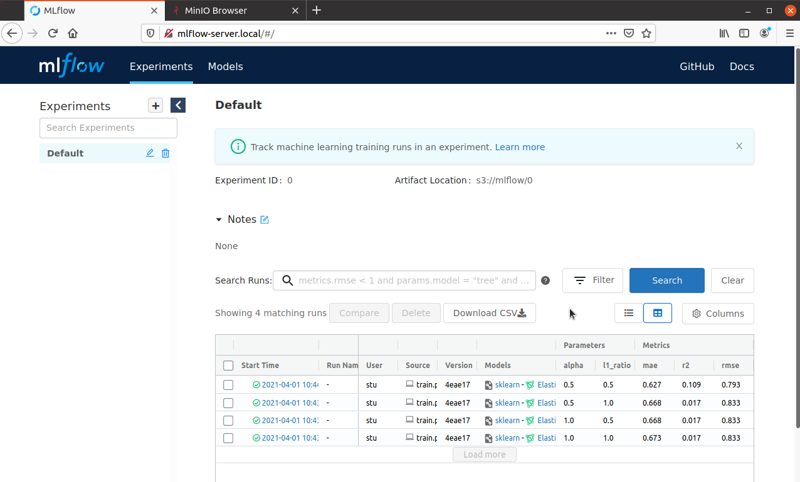

# CAPSTONE PROJECT FOR UDACITY's Cloud DevOps Engineering Nanodegree

## Project Scope

Continuous Delivery of a web service for managing machine learning models using [MLflow](https://mlflow.org).  Illustrated below is the pipeline chosen.  


The architecture for the project is shown below.


This project uses a blue/green deployment approach.

## Getting Started: Stand up the service with AWS

Follow these steps to re-create the service on AWS.  Before you begin, please set up accounts with the following:

1. [GitHub](https://github.com/) - used to for code and configuration files storage, and triggers CircleCI when changes are commite
2. [CircleCI](https://circleci.com/signup/?source-button=free) - used for automated management of the CI/CD pipeline
3. [Amazon Web Services](https://console.aws.amazon.com/console/home?nc2=h_ct&src=header-signin) - implementation of the service
4. [DockerHub](https://hub.docker.com/) - used to store images of the MLflow server

## #Step 1: Clone the repo and push to your GitHub account

```
    git clone https://github.com/StuKozola/Udacity-CloudDevOps-Capstone
```

### Step 2: Create AWS Access and EC2 Key

### Step 3: Configure CircleCI

Create an account on CircleCI using the free tier.  Once created, [add the github project](https://circleci.com/docs/2.0/getting-started/#setting-up-circleci) to CircleCI.  You will need to create a  [Context](https://circleci.com/docs/2.0/contexts/) named `CAPSTONE` to define the environment variables needed for the project before running it.  The variables to define are shown below.

```bash
AWS_ACCESS_KEY_ID=<Your AWS Access Key>
AWS_DEFAULT_REGION=<Your AWS Region of Choice>
AWS_EC2_KEY_NAME=<Your EC2 Key>
AWS_SECRET_ACCESS_KEY=<Your AWS Secret Access Key>
DOCKER_PASS=<Your DockerHub Password>
DOCKER_USER=<Your DockerHub Username>
PGDATA=/var
POSTGRES_DB=mlflowdb
POSTGRES_PASSWORD=<choose your own>
POSTGRES_USER=<choose your own>
```

Your context should be similar to the one below.


### Step 3: Start the worfklow in CircleCI

Build
Test
Deployment

## Dependencies

This project has been developed and validated on Ubuntu linux.  A makefile is provided that can be used for installing, configuring, and running this project on a desktop or VM from the git repository.  If you are using a different platform, you will need to have these dependencies installed prior using this repo.
1. git
2. make
3. python 3.8+
4. python3-venv

### Data Scientists Sandbox

The commands shown below will install, build, test, and run MLFlow with all the required dependencies on Ubuntu.  This configuration is the minimalist configuration in that it installs MLFlow and it's dependencies only.

```bash
    make setup-ubuntu
    make install-local
    make build-local
    make run-local
```

After running these commands, you should see the MLFlow experiment tracking app in a local browser (http://127.0.0.1:5000).


### Desktop Development with Minikube

This configuration will build and test a local development environment that mirrors the AWS deployed application.  It uses:
1. [Minikube](https://minikube.sigs.k8s.io/docs/start/) to replicate [Kubernetes](https://kubernetes.io/)
2. [Docker](https://www.docker.com) for images and image scanning
3. [Hadolint](https://github.com/hadolint/hadolint) for linting Dockerfiles
4. [MinIO](https://min.io) for S3 bucket emulation
5. [PostgreSQL](https://www.postgresql.org/) for MLFlow backend storage

To install and run on a clean Ubuntu installation:   
```bash
    make setup-ubuntu
    make install-local-k8
    make build-local-k8
    make run-local-k8
```
Next you will need to modify host files
After running these commands, you should see the MLFlow experiment tracking app in a local browser (http://127.0.0.1:5000).


You can also run `make clean` to clean up temporary downloaded files, and `make destroy` to shut down and delete pods created in minikube.