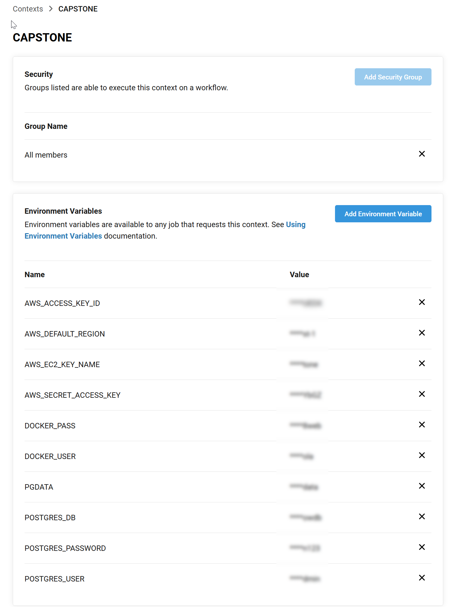

# CAPSTONE PROJECT FOR UDACITY's Cloud DevOps Engineering Nanodegree

## Project Scope

Continuous Delivery of a web service for managing machine learning models using [mlflow](https://mlflow.org).  Illustrated below is the pipeline chosen and implemented in CircleCI.  Red lines indicate the path for a failed job.


The architecture for the project is shown below.  This is the architecture built on AWS using the cloudformation templates in the .circelci/aws folder.


This project uses a blue/green deployment approach.  Once a build and new K8 deployment is successful, cloudfront is updated to point to the new service, and the old infrastructure is torn down and destroyed.

This project has been developed and validated on Ubuntu linux.  A makefile is provided that can be used for installing, configuring, and running this project on a desktop or VM from the git repository.  If you are using a different platform, you will need to have these dependencies installed prior using this repo.

1. git
2. make
3. python 3.8+
4. python3-venv

For local builds and testing, see [Desktop.md](Desktop.md)

# Getting Started: Stand up the service with AWS

Follow these steps to re-create the service on AWS.  Before you begin, please set up accounts with the following:

1. [GitHub](https://github.com/) - used to for code and configuration files storage, and triggers CircleCI when changes are commite
2. [CircleCI](https://circleci.com/signup/?source-button=free) - used for automated management of the CI/CD pipeline
3. [Amazon Web Services](https://console.aws.amazon.com/console/home?nc2=h_ct&src=header-signin) - implementation of the service
4. [DockerHub](https://hub.docker.com/) - used to store images of the mlflow server in a docker image

## Step 1: Clone the repo and push to your GitHub account

```
    git clone https://github.com/StuKozola/Udacity-CloudDevOps-Capstone
```

## Step 2: Create AWS Access and EC2 Key
You will need to provide your keys in CircleCI.  You may also want to create an EC2 Key if you want to interact with any of the EC2 instances.

## Step 3: Configure CircleCI

Create an account on CircleCI using the free tier.  Once created, [add the github project](https://circleci.com/docs/2.0/getting-started/#setting-up-circleci) to CircleCI.  You will need to create a  [Context](https://circleci.com/docs/2.0/contexts/) named `CAPSTONE` to define the environment variables needed for the project before running it.  The variables to define are shown below.

```bash
AWS_ACCESS_KEY_ID=<Your AWS Access Key>
AWS_DEFAULT_REGION=<Your AWS Region of Choice>
AWS_EC2_KEY_NAME=<Your EC2 Key>
AWS_SECRET_ACCESS_KEY=<Your AWS Secret Access Key>
DOCKER_PASS=<Your DockerHub Password>
DOCKER_USER=<Your DockerHub Username>
PGDATA=/var
POSTGRES_DB=mlflowdb
POSTGRES_PASSWORD=<choose your own>
POSTGRES_USER=<choose your own>
```

Your context should be similar to the one below.



## Step 3: Start the worfklow in CircleCI

Now that you have linked CircleCI to you gitHub repo, start the first build.  The pipeline will be processed each time code is submitted to the master branch (you can change this in you CircleCI configuration if desired).

## Step 4: View and interact with the deployed mlflow service
The mlflow server is exposed on port 5000.  You can find the url from X.

